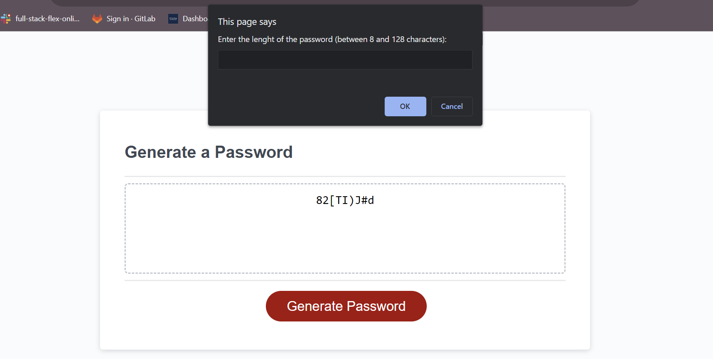

# Password Generator Starter Code

Random Password Generator 

## Description

The goal was to troubleshoot a pre existing code for a random password generator website. An employee can use this website to generate a random password based on criteria they've selected. This runs in the browser, and features dynamically updated HTML and CSS powered by JavaScript code. It has a clean and polished user interface that is responsive, ensuring that it adapts to multiple screen sizes.

## Table of Contents (Optional)

- [Installation](#installation)
- [Usage](#usage)
- [link](#link)
- [Credits](#credits)
- [License](#license)

## Installation

N/A. This is a website which is accessible with internet connection an a browser navigator. 

## Usage

The user is received with the title "Password Generator" followed by the sub title "Generate a password. A red button is placed below a white square that containing the text "Generate Password". When pressed, the red button will prompt you to write the amount of characters included in the generated password. Once responded, the website will prompt you to select if lower case characters should be included, followed by the prompt for upper case, numeric characters, and special characters. Once the user has selected all prompts a randomized generated password should appear in the white square above the red button.

## Link

This is the link to the deployed website:

## Credits

https://stackoverflow.com/questions/1497481/javascript-password-generator

https://dev.to/code_mystery/random-password-generator-using-javascript-6a

https://www.youtube.com/watch?v=Xrsb9SiF3a8

https://foolishdeveloper.com/random-password-generator-with-javascript/

https://www.tutorialstonight.com/password-generator-in-javascript

## License

Please refer to the license in the repo.
